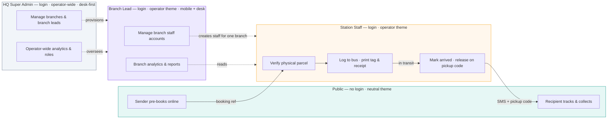
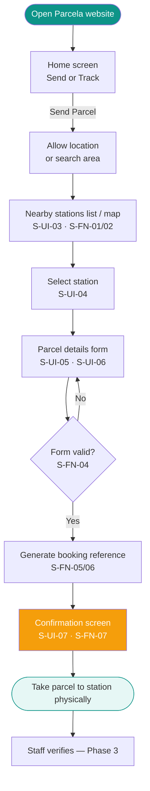
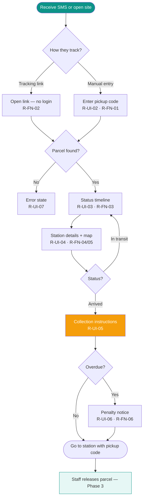
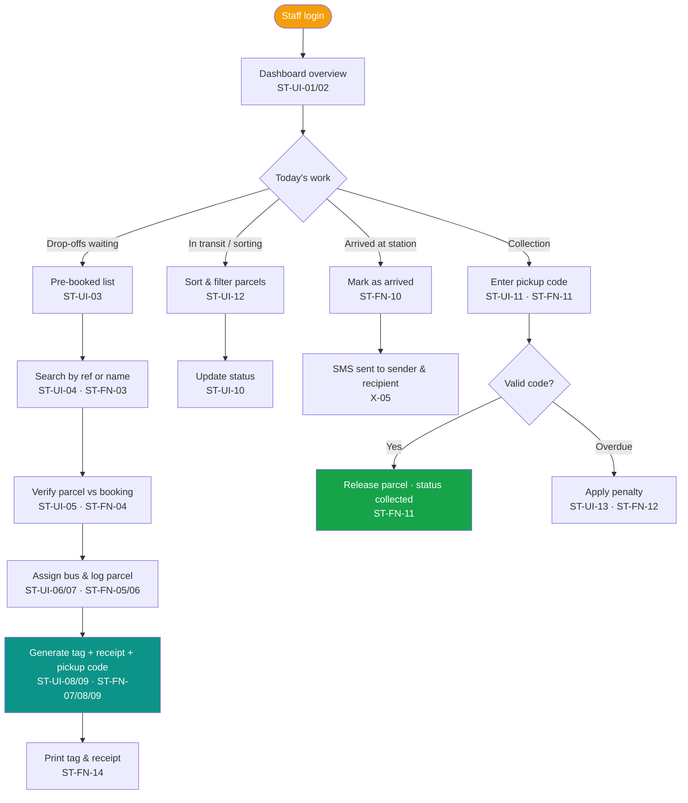
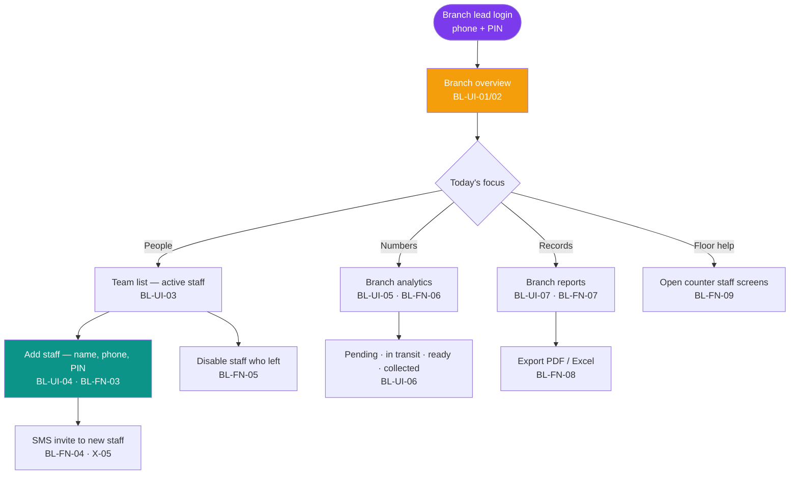
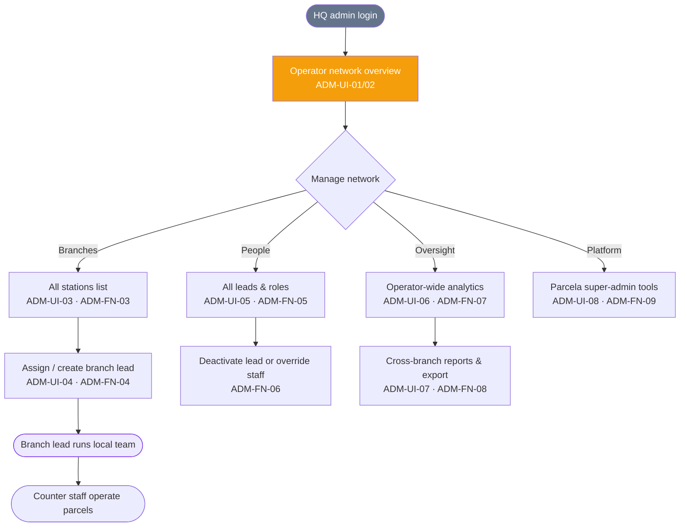
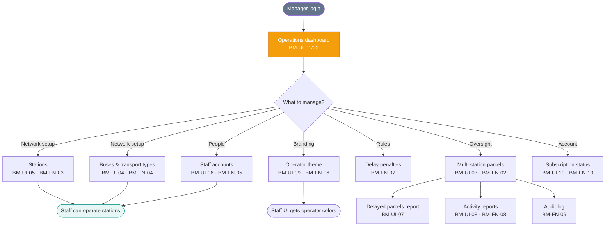
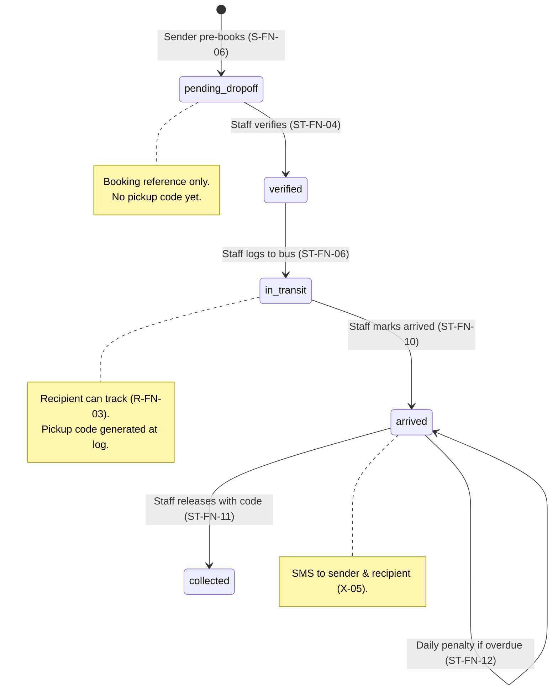
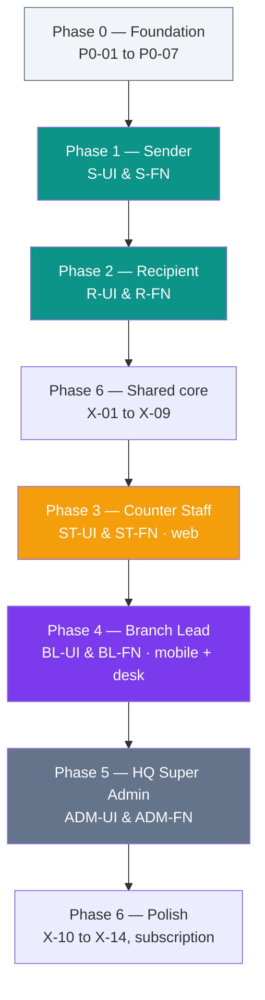

# Parcela — Implementation Task Tracker

**Product:** Bus Parcel Management Platform  
**Approach:** Mobile-first web application  
**Public theme:** Neutral (Teal `#0D9488` + Amber `#F59E0B` accent)  
**Last updated:** July 7, 2026

---

## How to use this document

- Work through phases in order unless a task has no blockers.
- Update **Status** as work progresses: `Not Started` → `In Progress` → `Done` → `Blocked`
- Check off sub-tasks with `[x]` when complete.
- Staff, Branch Lead, and HQ Admin work builds on Sender + Recipient + shared API.

**Status legend:** `⬜ Not Started` · `🔄 In Progress` · `✅ Done` · `🚫 Blocked`

---

## User Flow Diagrams

Use these diagrams as the map. Each box links to task IDs in the tables below.

### 1. End-to-end parcel journey (all roles)

---

### 2. Sender flow → screens & tasks

| Step | Screen         | Task IDs                                    |
| ---- | -------------- | ------------------------------------------- |
| 1    | Home           | S-UI-02                                     |
| 2    | Station finder | S-UI-03, S-FN-01, S-FN-02, S-FN-03          |
| 3    | Select station | S-UI-04                                     |
| 4    | Parcel form    | S-UI-05, S-UI-06, S-FN-04                   |
| 5    | Confirmation   | S-UI-07, S-FN-05, S-FN-06, S-FN-07, S-FN-08 |

---

### 3. Recipient flow → screens & tasks

| Step | Screen             | Task IDs                  |
| ---- | ------------------ | ------------------------- |
| 1    | Track entry        | R-UI-02, R-FN-01, R-FN-02 |
| 2    | Status timeline    | R-UI-03, R-FN-03, R-FN-04 |
| 3    | Station + map      | R-UI-04, R-FN-05, R-FN-07 |
| 4    | Collection info    | R-UI-05                   |
| 5    | Penalties (if any) | R-UI-06, R-FN-06          |
| 6    | Errors             | R-UI-07                   |

---

### 4. Staff flow → screens & tasks

| Step         | Action            | Task IDs                                  |
| ------------ | ----------------- | ----------------------------------------- |
| Login        | Auth              | ST-UI-01, ST-FN-01, ST-FN-02              |
| Find booking | Search            | ST-UI-03, ST-UI-04, ST-FN-03              |
| Verify & log | Core workflow     | ST-UI-05–07, ST-FN-04–06                  |
| Documents    | Tag & receipt     | ST-UI-08, ST-UI-09, ST-FN-07–09, ST-FN-14 |
| Arrival      | Notify customers  | ST-FN-10, X-05                            |
| Collection   | Release           | ST-UI-11, ST-FN-11, ST-FN-12              |
| Theme        | Operator branding | ST-UI-14                                  |

---

### 5. Branch Lead flow → screens & tasks

| Area | Task IDs |
| ---- | -------- |
| Login | BL-UI-01, BL-FN-01, BL-FN-02 |
| Overview | BL-UI-02, BL-FN-06 |
| Team management | BL-UI-03, BL-UI-04, BL-FN-03–05 |
| Analytics | BL-UI-05, BL-UI-06, BL-FN-06 |
| Reports | BL-UI-07, BL-FN-07, BL-FN-08 |
| Mobile + desk | BL-UI-08, BL-FN-10 |
| Optional counter access | BL-FN-09 |

**Scope rule:** Branch lead sees **one station only** (e.g. Berekum). Accra HQ does not manage daily staff here.

---

### 6. HQ Super Admin flow → screens & tasks

| Area | Task IDs |
| ---- | -------- |
| Login & roles | ADM-UI-01, ADM-FN-01, ADM-FN-02 |
| Network overview | ADM-UI-02, ADM-FN-07 |
| Branches | ADM-UI-03, ADM-FN-03 |
| Branch leads | ADM-UI-04, ADM-FN-04 |
| Role management | ADM-UI-05, ADM-FN-05, ADM-FN-06 |
| Analytics & reports | ADM-UI-06, ADM-UI-07, ADM-FN-08 |
| Parcela platform admin | ADM-UI-08, ADM-FN-09 |

**Build order:** Branch Lead portal first · HQ Super Admin after branch lead is proven in the field.

---

### 7. Bus Manager flow → screens & tasks _(legacy — superseded by Branch Lead + HQ Admin)_

> **Note:** Original “Bus Manager” scope is split into **Phase 4 (Branch Lead)** and **Phase 5 (HQ Super Admin)**. Keep `BM-*` IDs for reference only; new work uses `BL-*` and `ADM-*`.

| Area         | Task IDs                               |
| ------------ | -------------------------------------- |
| Dashboard    | BM-UI-02, BM-FN-02                     |
| Stations     | BM-UI-05, BM-FN-03                     |
| Buses        | BM-UI-04, BM-FN-04                     |
| Staff        | BM-UI-06, BM-FN-05                     |
| Branding     | BM-UI-09, BM-FN-06                     |
| Reports      | BM-UI-07, BM-UI-08, BM-FN-08, BM-FN-09 |
| Subscription | BM-UI-10, BM-FN-10                     |

---

### 8. Parcel status lifecycle

---

### 9. Implementation roadmap (what to build, in order)

> **You are here:** Counter staff portal wired to API · Branch Lead portal next · HQ Admin after that

**Role model (Ghana-friendly):**

| Role | Portal | Device | Scope |
| ---- | ------ | ------ | ----- |
| Counter staff | `/staff` | Web at terminal | One station · parcel operations |
| Branch lead | `/lead` (proposed) | Mobile + desktop | One station · team + analytics + reports |
| HQ super admin | `/admin` (proposed) | Desktop-first | Whole operator (VIP or STC) · all branches |
| Parcela platform | internal | Desktop | Onboard operators, stations, first HQ user |

**Account creation:** Branch lead creates counter staff for their branch. HQ admin creates branch leads and branches. Parcela onboards the operator initially (no extra public dashboards for VIP/STC at MVP).

---

## Phase 0 — Project Foundation

| ID    | Task                                                         | Status         | Notes                                            |
| ----- | ------------------------------------------------------------ | -------------- | ------------------------------------------------ |
| P0-01 | Initialize project (repo, folder structure, package manager) | ✅ Done        | Next.js 15, TypeScript, Tailwind 4               |
| P0-02 | Set up design tokens (colors, typography, spacing)           | ✅ Done        | Teal primary, amber CTA, slate neutrals          |
| P0-03 | Build shared UI component library                            | ✅ Done        | Button, Input, Card, Label, PageHeader, AppShell |
| P0-04 | Set up database schema (core entities)                       | 🔄 In Progress | MongoDB + Mongoose in `backend/`                 |
| P0-05 | Set up API layer / server actions                            | 🔄 In Progress | NestJS REST API (`backend/`)                     |
| P0-06 | Configure environment variables and secrets                  | 🔄 In Progress | `.env.example` + `backend/.env.example`          |
| P0-07 | Set up authentication (staff, lead, admin)     | 🔄 In Progress | Roles: `station_staff`, `station_lead`, `operator_admin` |

---

## Phase 1 — Sender (Public, No Login)

**Goal:** Sender can find a station, pre-book a parcel online, and receive a booking reference before physical drop-off.

> **Flow diagram:** See [Sender flow → screens & tasks](#2-sender-flow--screens--tasks) above.

### 1.1 Design & UI

| ID      | Task                                                       | Status         | Notes                                   |
| ------- | ---------------------------------------------------------- | -------------- | --------------------------------------- |
| S-UI-01 | Mobile wireframes: Home, Send Parcel, Booking Confirmation | ✅ Done        | Implemented as live screens             |
| S-UI-02 | Home screen — dual entry (Send / Track)                    | ✅ Done        | `/`                                     |
| S-UI-03 | Nearby station finder UI                                   | ✅ Done        | List + map view (web + mobile)          |
| S-UI-04 | Station selection screen                                   | ✅ Done        | Tap station card → book flow            |
| S-UI-05 | Parcel details form                                        | ✅ Done        | `/send/book`                            |
| S-UI-06 | Fragile / special handling toggle                          | ✅ Done        | Checkbox on form                        |
| S-UI-07 | Booking confirmation screen                                | ✅ Done        | `/send/confirm`                         |
| S-UI-08 | Responsive polish (tablet + desktop)                       | ✅ Done        | AppShell md/lg; station grid on tablet  |

### 1.2 Functionality

| ID      | Task                                            | Status         | Notes                               |
| ------- | ----------------------------------------------- | -------------- | ----------------------------------- |
| S-FN-01 | Geolocation — detect user location              | ✅ Done        | Browser geolocation with fallback   |
| S-FN-02 | Nearby stations API — sort by distance          | ✅ Done        | Client-side mock + haversine sort   |
| S-FN-03 | Station search by name or area                  | ✅ Done        | Search by name, city, code, address |
| S-FN-04 | Parcel pre-booking form validation              | ✅ Done        | Required fields + phone format      |
| S-FN-05 | Generate unique booking reference on submit     | ✅ Done        | `PCL-XXXX-XXXX` format              |
| S-FN-06 | Save pre-booking with status `pending_dropoff`  | ✅ Done        | sessionStorage (DB pending)         |
| S-FN-07 | Display booking summary (printable / shareable) | ✅ Done        | Share + print (web); share image (mobile) |
| S-FN-08 | Optional SMS to sender with booking reference   | 🚫 Blocked     | Requires backend + SMS provider (Phase 5) |

### 1.3 Sender acceptance criteria

- [x] Sender can open site without creating an account
- [x] Sender sees nearby stations based on location
- [x] Sender completes parcel form and gets a booking reference
- [ ] Booking appears in staff dashboard as awaiting drop-off
- [x] UI works well on mobile (primary target)

---

## Phase 2 — Recipient (Public, No Login)

**Goal:** Recipient can track parcel status and collect using a unique pickup code.

> **Flow diagram:** See [Recipient flow → screens & tasks](#3-recipient-flow--screens--tasks) above.

### 2.1 Design & UI

| ID      | Task                                               | Status         | Notes                                         |
| ------- | -------------------------------------------------- | -------------- | --------------------------------------------- |
| R-UI-01 | Mobile wireframes: Track Entry, Status, Collection | ✅ Done        | Live screens web + mobile                     |
| R-UI-02 | Track parcel entry screen                          | ✅ Done        | Pickup code + demo tracking links             |
| R-UI-03 | Parcel status timeline UI                          | ✅ Done        | Pre-booked → In transit → Arrived → Collected |
| R-UI-04 | Destination station details card                   | ✅ Done        | Name, address, map, hours                     |
| R-UI-05 | Collection instructions screen                     | ✅ Done        | Code, ID requirements, penalties note         |
| R-UI-06 | Delay / holding penalty notice UI                  | ✅ Done        | Grace period + overdue fees (mock rules)      |
| R-UI-07 | Empty and error states                             | ✅ Done        | Invalid code, not found, invalid link         |

### 2.2 Functionality

| ID      | Task                                    | Status         | Notes                                 |
| ------- | --------------------------------------- | -------------- | ------------------------------------- |
| R-FN-01 | Lookup parcel by unique pickup code     | ✅ Done        | Mock demos + local sender bookings    |
| R-FN-02 | Lookup parcel by tracking link token    | ✅ Done        | `/track/t/[token]` (mock tokens)      |
| R-FN-03 | Display real-time parcel status         | 🚫 Blocked     | Mock until staff API (Phase 3)        |
| R-FN-04 | Show expected arrival time              | ✅ Done        | Shown when in transit                 |
| R-FN-05 | Show destination station on map         | ✅ Done        | Leaflet (web) + react-native-maps     |
| R-FN-06 | Calculate and display holding penalties | ✅ Done        | 3-day grace, GHS 5/day (mock)         |
| R-FN-07 | Mask sensitive data appropriately       | ✅ Done        | Masked recipient phone on track views |

### 2.3 Recipient acceptance criteria

- [ ] Recipient opens tracking link from SMS without login
- [ ] Recipient can enter pickup code manually
- [ ] Status timeline reflects current parcel state
- [ ] Station location and collection info are clear on mobile
- [ ] Penalty info shown when parcel is overdue for collection

---

## Phase 3 — Station Staff Dashboard

**Goal:** Staff verify physical parcels, log them officially, tag them, and manage collection at their station.

**Access:** Secure login · Station-scoped data only · Operator-themed UI (VIP, STC, custom)

> **Flow diagram:** See [Staff flow → screens & tasks](#4-staff-flow--screens--tasks) above.

### 3.1 Design & UI

| ID       | Task                                        | Status         | Notes                                     |
| -------- | ------------------------------------------- | -------------- | ----------------------------------------- |
| ST-UI-01 | Staff login screen                          | ⬜ Not Started | Operator theme applied                    |
| ST-UI-02 | Dashboard home — today's overview           | ⬜ Not Started | Pending, in transit, arrived, uncollected |
| ST-UI-03 | Pre-booked parcels list (awaiting drop-off) | ⬜ Not Started |                                           |
| ST-UI-04 | Parcel search UI                            | ⬜ Not Started | Reference, name, bus, destination         |
| ST-UI-05 | Parcel verification screen                  | ⬜ Not Started | Compare online vs physical                |
| ST-UI-06 | Parcel logging form                         | ⬜ Not Started | Bus, transport type, item type            |
| ST-UI-07 | Fragile / special handling tag UI           | ⬜ Not Started |                                           |
| ST-UI-08 | Parcel tag preview and print view           | ⬜ Not Started | Per product brief section 7               |
| ST-UI-09 | Receipt preview and print view              | ⬜ Not Started | Per product brief section 8               |
| ST-UI-10 | Parcel status update controls               | ⬜ Not Started |                                           |
| ST-UI-11 | Collection / release screen                 | ⬜ Not Started | Verify pickup code                        |
| ST-UI-12 | Sort and filter views                       | ⬜ Not Started | By bus, type, destination, status         |
| ST-UI-13 | Delay penalty application UI                | ⬜ Not Started |                                           |
| ST-UI-14 | White-label theme per operator              | ⬜ Not Started | VIP, STC, neutral/custom                  |

### 3.2 Functionality

| ID       | Task                                            | Status         | Notes                                  |
| -------- | ----------------------------------------------- | -------------- | -------------------------------------- |
| ST-FN-01 | Staff authentication and session management     | ⬜ Not Started |                                        |
| ST-FN-02 | Restrict staff to own station data              | ⬜ Not Started | Row-level / station scope              |
| ST-FN-03 | Search pre-bookings by reference or sender name | ⬜ Not Started |                                        |
| ST-FN-04 | Verify and confirm parcel details               | ⬜ Not Started | Status: `pending_dropoff` → `verified` |
| ST-FN-05 | Assign parcel to bus and transport type         | ⬜ Not Started |                                        |
| ST-FN-06 | Officially log parcel                           | ⬜ Not Started | Status: `verified` → `in_transit`      |
| ST-FN-07 | Generate unique pickup / collection ID          | ⬜ Not Started | Separate from booking reference        |
| ST-FN-08 | Generate parcel tag data                        | ⬜ Not Started | Sender, recipient, bus, fragile, etc.  |
| ST-FN-09 | Generate official receipt                       | ⬜ Not Started | Full receipt fields per brief          |
| ST-FN-10 | Mark parcel as arrived at destination           | ⬜ Not Started | Triggers recipient/sender SMS          |
| ST-FN-11 | Release parcel on valid pickup code             | ⬜ Not Started | Status: `arrived` → `collected`        |
| ST-FN-12 | Apply daily holding penalties                   | ⬜ Not Started |                                        |
| ST-FN-13 | Record staff identifier on actions              | ⬜ Not Started | Audit trail                            |
| ST-FN-14 | Print / export tag and receipt                  | ⬜ Not Started |                                        |

### 3.3 Staff acceptance criteria

- [ ] Staff logs in and sees only their station's parcels
- [ ] Staff finds pre-booking and verifies physical parcel
- [ ] Staff assigns bus and logs parcel officially
- [ ] System generates receipt, tag, and pickup code
- [ ] Staff can search, sort, and update parcel status
- [ ] Staff can release parcel using pickup code
- [ ] Dashboard uses correct operator brand theme

---

## Phase 4 — Branch Lead Portal

**Goal:** Branch lead manages **their station’s** counter staff, sees **branch-only** analytics and reports, on **phone and desktop**. No operator-wide admin UI.

**Access:** Secure login (phone + PIN recommended) · `station_lead` role · single `stationId` + `operator`

**Example:** VIP headquarters is in Accra, but the **Berekum branch lead** adds/removes Berekum counter staff — Accra HQ is not in that daily loop.

> **Flow diagram:** See [Branch Lead flow → screens & tasks](#5-branch-lead-flow--screens--tasks) above.

### 4.1 Design & UI

| ID       | Task                                              | Status         | Notes                                      |
| -------- | ------------------------------------------------- | -------------- | ------------------------------------------ |
| BL-UI-01 | Branch lead login screen                          | ⬜ Not Started | Phone + PIN; operator theme                |
| BL-UI-02 | Branch overview home                              | ⬜ Not Started | Today’s counts, quick actions              |
| BL-UI-03 | Team list — active counter staff                  | ⬜ Not Started | Name, phone, status, last active           |
| BL-UI-04 | Add staff form                                    | ⬜ Not Started | Name, phone, PIN; station auto-filled      |
| BL-UI-05 | Branch analytics dashboard                        | ⬜ Not Started | Charts/cards: volume by status             |
| BL-UI-06 | Metric cards — pending, in transit, ready, collected | ⬜ Not Started | Reuse staff report metrics, branch-scoped |
| BL-UI-07 | Branch reports screen                             | ⬜ Not Started | Reuse station records UI, branch-scoped only |
| BL-UI-08 | Responsive layout — mobile lead home + desk tables | ⬜ Not Started | Same routes; mobile-first summary          |

### 4.2 Functionality

| ID       | Task                                              | Status         | Notes                                       |
| -------- | ------------------------------------------------- | -------------- | ------------------------------------------- |
| BL-FN-01 | Branch lead authentication (phone + PIN / token)  | ⬜ Not Started | `station_lead` role in staff collection     |
| BL-FN-02 | Restrict lead to own `stationId` + `operator`     | ⬜ Not Started | Cannot see other branches                   |
| BL-FN-03 | Create counter staff account for own branch       | ⬜ Not Started | Role: `station_staff`                       |
| BL-FN-04 | SMS invite / credentials to new staff (mNotify)   | ⬜ Not Started | Ghana onboarding pattern                    |
| BL-FN-05 | Disable / re-enable staff at own branch           | ⬜ Not Started | Soft delete; audit who changed              |
| BL-FN-06 | Branch analytics API — aggregates by status/date  | ⬜ Not Started | Same DB as sender/recipient/staff parcels   |
| BL-FN-07 | Branch reports — filter parcels for one station   | ⬜ Not Started | Reuse `staff-reports` engine                |
| BL-FN-08 | Export branch reports PDF / Excel                 | ⬜ Not Started | Lead-only exports                           |
| BL-FN-09 | Optional: lead can open counter staff screens     | ⬜ Not Started | Same `/staff` UI when short-staffed         |
| BL-FN-10 | Mobile-optimized API responses for lead summary   | ⬜ Not Started | Lightweight counts for phone                |

### 4.3 Branch Lead acceptance criteria

- [ ] Lead logs in and sees **only their branch** data
- [ ] Lead can add a counter staff member (phone + PIN) for their station
- [ ] New staff receives SMS with login instructions
- [ ] Lead can disable staff who left the branch
- [ ] Lead sees branch analytics (not other branches)
- [ ] Lead can generate and export branch reports
- [ ] UI works on **mobile and desktop**
- [ ] Lead does **not** need a separate “HR system” — team + numbers + reports in one place

---

## Phase 5 — HQ Super Admin (Operator Admin)

**Goal:** VIP or STC headquarters oversees **all branches** — create stations & branch leads, operator-wide analytics, role control. Built **after** Branch Lead portal is working.

**Access:** Secure login · `operator_admin` role · scoped to one operator (VIP **or** STC, not both)

> **Flow diagram:** See [HQ Super Admin flow → screens & tasks](#6-hq-super-admin-flow--screens--tasks) above.

### 5.1 Design & UI

| ID        | Task                                           | Status         | Notes                                |
| --------- | ---------------------------------------------- | -------------- | ------------------------------------ |
| ADM-UI-01 | HQ admin login screen                          | ⬜ Not Started | Desktop-first; operator branding     |
| ADM-UI-02 | Operator network overview                      | ⬜ Not Started | All branches KPIs, alerts            |
| ADM-UI-03 | Stations / branches list                       | ⬜ Not Started | Kaneshie, Berekum, Tema, etc.        |
| ADM-UI-04 | Create / assign branch lead per station        | ⬜ Not Started | Name, phone, station picker          |
| ADM-UI-05 | Roles directory — leads and staff (read/manage) | ⬜ Not Started | Filter by branch, role, active         |
| ADM-UI-06 | Operator-wide analytics                        | ⬜ Not Started | Compare branches, trends             |
| ADM-UI-07 | Cross-branch reports & export                  | ⬜ Not Started | HQ rollups for management            |
| ADM-UI-08 | Parcela platform panel (internal)              | ⬜ Not Started | Onboard VIP/STC, seed stations       |

### 5.2 Functionality

| ID        | Task                                           | Status         | Notes                                |
| --------- | ---------------------------------------------- | -------------- | ------------------------------------ |
| ADM-FN-01 | HQ admin authentication & `operator_admin` role | ⬜ Not Started |                                     |
| ADM-FN-02 | Restrict admin to one operator (VIP or STC)    | ⬜ Not Started |                                     |
| ADM-FN-03 | View / manage stations for operator            | ⬜ Not Started | CRUD or activate/deactivate          |
| ADM-FN-04 | Create & assign branch lead accounts           | ⬜ Not Started | Links lead → `stationId`             |
| ADM-FN-05 | View all leads and staff across branches       | ⬜ Not Started | Read-focused; leads own daily staff  |
| ADM-FN-06 | Deactivate branch lead or emergency staff lock | ⬜ Not Started | Audit trail                          |
| ADM-FN-07 | Operator-wide analytics API                    | ⬜ Not Started | Sum/average across stations          |
| ADM-FN-08 | Cross-branch report export                     | ⬜ Not Started | PDF / Excel                          |
| ADM-FN-09 | Parcela super-admin: onboard operator + HQ user | ⬜ Not Started | Internal tooling; not customer-facing |

### 5.3 HQ Super Admin acceptance criteria

- [ ] HQ admin sees all branches for their operator (e.g. all VIP stations)
- [ ] HQ admin can create a branch and assign a branch lead
- [ ] HQ admin does **not** micromanage every counter PIN (delegated to leads)
- [ ] HQ admin can view operator-wide analytics and exports
- [ ] HQ admin can deactivate a lead or staff account in an emergency
- [ ] Parcela team can onboard a new operator without building extra VIP/STC dashboards

---

## Phase 6 — Legacy Bus Manager _(reference only)_

> Superseded by **Phase 4 (Branch Lead)** and **Phase 5 (HQ Super Admin)**. Do not build `BM-*` as a third customer-facing product.

**Goal:** _(archived)_ Bus manager oversees operations across stations, buses, staff activity, and reporting for their operator network.

**Access:** Secure login · Operator-level scope (may span multiple stations)

> **Flow diagram:** See [Bus Manager flow → screens & tasks](#7-bus-manager-flow--screens--tasks-legacy--superseded-by-branch-lead--hq-admin) above.

### 6.1 Design & UI _(legacy BM)_

| ID       | Task                                 | Status         | Notes                           |
| -------- | ------------------------------------ | -------------- | ------------------------------- |
| BM-UI-01 | Manager login screen                 | ⬜ Not Started | Operator-themed                 |
| BM-UI-02 | Operations overview dashboard        | ⬜ Not Started | KPIs, alerts                    |
| BM-UI-03 | Multi-station parcel overview        | ⬜ Not Started | Filter by station, status, date |
| BM-UI-04 | Bus and route management UI          | ⬜ Not Started | Bus numbers, transport types    |
| BM-UI-05 | Station management UI                | ⬜ Not Started | Station codes, locations, hours |
| BM-UI-06 | Staff accounts management UI         | ⬜ Not Started | Create, disable, assign station |
| BM-UI-07 | Delayed / uncollected parcels report | ⬜ Not Started |                                 |
| BM-UI-08 | Daily / weekly activity reports      | ⬜ Not Started | Volume, revenue summary         |
| BM-UI-09 | Operator theme configuration         | ⬜ Not Started | Colors, logo (VIP, STC, custom) |
| BM-UI-10 | Subscription / license status view   | ⬜ Not Started | Plan, expiry, renewal           |

### 6.2 Functionality _(legacy BM)_

| ID       | Task                                        | Status         | Notes                        |
| -------- | ------------------------------------------- | -------------- | ---------------------------- |
| BM-FN-01 | Manager authentication and role permissions | ⬜ Not Started |                              |
| BM-FN-02 | View parcels across all operator stations   | ⬜ Not Started | Read-focused oversight       |
| BM-FN-03 | CRUD stations                               | ⬜ Not Started | Name, code, location, hours  |
| BM-FN-04 | CRUD buses and transport types              | ⬜ Not Started |                              |
| BM-FN-05 | CRUD staff accounts and station assignments | ⬜ Not Started |                              |
| BM-FN-06 | Configure operator brand theme              | ⬜ Not Started | Applied to staff dashboards  |
| BM-FN-07 | Configure delay penalty rules               | ⬜ Not Started | Grace period, daily rate     |
| BM-FN-08 | Export reports (CSV / PDF)                  | ⬜ Not Started |                              |
| BM-FN-09 | View audit log of staff actions             | ⬜ Not Started |                              |
| BM-FN-10 | Subscription plan enforcement               | ⬜ Not Started | 1yr / 2yr / 3yr / enterprise |

### 6.3 Bus Manager acceptance criteria _(legacy)_

- [ ] Manager sees network-wide parcel and station overview
- [ ] Manager can manage stations, buses, and staff
- [ ] Manager can configure operator branding for staff UI
- [ ] Manager can view delayed parcels and basic reports
- [ ] Subscription status is visible and enforced

---

## Phase 7 — Shared Systems (Cross-Cutting)

These support all roles and should be built alongside or immediately after Phase 1–2.

| ID   | Task                                         | Status         | Notes                     |
| ---- | -------------------------------------------- | -------------- | ------------------------- |
| X-01 | Core parcel data model and status machine    | ⬜ Not Started | See status flow below     |
| X-02 | Station data model and geolocation           | ⬜ Not Started |                           |
| X-03 | Operator and transport type data model       | ⬜ Not Started |                           |
| X-04 | SMS integration — booking confirmation       | ⬜ Not Started | Sender                    |
| X-05 | SMS integration — arrival notification       | ⬜ Not Started | Sender + recipient        |
| X-06 | SMS integration — collection reminders       | ⬜ Not Started | Recipient                 |
| X-07 | Tracking link generation                     | ⬜ Not Started | Unique token per parcel   |
| X-08 | Pickup code generation                       | ⬜ Not Started | Separate from booking ref |
| X-09 | Maps integration (station finder + tracking) | ⬜ Not Started | Google Maps or similar    |
| X-10 | Receipt PDF generation                       | ⬜ Not Started |                           |
| X-11 | Parcel tag print layout                      | ⬜ Not Started |                           |
| X-12 | Audit logging for staff actions              | ⬜ Not Started |                           |
| X-13 | Error handling and logging                   | ⬜ Not Started |                           |
| X-14 | Basic admin seed data (operators, stations)  | ⬜ Not Started | Dev / demo                |

---

## Parcel Status Flow

> **Visual diagram:** See [Parcel status lifecycle](#8-parcel-status-lifecycle) above.

Optional states to add later: `cancelled`, `lost`, `returned_to_sender`

---

## Recommended Build Order

> **Visual diagram:** See [Implementation roadmap](#9-implementation-roadmap-what-to-build-in-order) above.

| Order | Phase                                         | Why                                       |
| ----- | --------------------------------------------- | ----------------------------------------- |
| 1     | Phase 0 — Foundation                          | Design tokens, project setup, data models |
| 2     | Phase 1 — Sender                              | First public flow; creates pre-bookings   |
| 3     | Phase 2 — Recipient                           | Tracking UI; can use mock statuses early  |
| 4     | Phase 7 (partial) — SMS, maps, status machine | Needed before staff go-live               |
| 5     | Phase 3 — Counter Staff (web)                 | Verifies and logs real parcels            |
| 6     | Phase 4 — Branch Lead (mobile + desk)         | Local team + branch analytics & reports   |
| 7     | Phase 5 — HQ Super Admin                      | Operator-wide branches, leads, rollups    |
| 8     | Phase 7 (remainder) — Polish, subscription    | Reports, audit, platform tooling          |

---

## Current Sprint Focus

> **Active phase:** Phase 1 polish + Phase 2 (Recipient)  
> **Next up:** Map view on station finder, DB persistence, Recipient tracking flow

| Task                            | Owner | Target | Status               |
| ------------------------------- | ----- | ------ | -------------------- |
| Confirm tech stack              | —     | —      | ✅ Done (Next.js 15) |
| Design tokens + base components | —     | —      | ✅ Done              |
| Sender Home screen              | —     | —      | ✅ Done              |
| Station finder                  | —     | —      | ✅ Done              |
| Parcel booking form             | —     | —      | ✅ Done              |
| Booking confirmation            | —     | —      | ✅ Done              |

---

## Open Decisions

| #   | Decision                 | Options                          | Chosen              |
| --- | ------------------------ | -------------------------------- | ------------------- |
| 1   | Frontend framework       | Next.js, Remix, other            | **Next.js 15**      |
| 2   | Database                 | PostgreSQL, Supabase, other      | TBD                 |
| 3   | SMS provider             | Hubtel, Africa's Talking, Twilio | TBD                 |
| 4   | Maps provider            | Google Maps, Mapbox              | TBD                 |
| 5   | Hosting                  | Vercel, Railway, VPS             | TBD                 |
| 6   | Booking reference format | `PCL-XXXX-XXXX` or other         | **`PCL-XXXX-XXXX`** |
| 7   | Pickup code format       | 6-digit numeric, alphanumeric    | TBD                 |

---

## Document changelog

| Date       | Change                                                               |
| ---------- | -------------------------------------------------------------------- |
| 2026-07-07 | Added Phase 4 Branch Lead (`BL-*`) and Phase 5 HQ Super Admin (`ADM-*`); archived legacy Bus Manager as Phase 6 |
| 2026-06-30 | Initial task tracker created — Sender, Recipient, Staff, Bus Manager |
| 2026-06-30 | Added user flow diagrams (Mermaid) with task ID mapping per role     |
| 2026-06-30 | Phase 0 foundation + Phase 1 Sender UI implemented (Next.js app)     |
